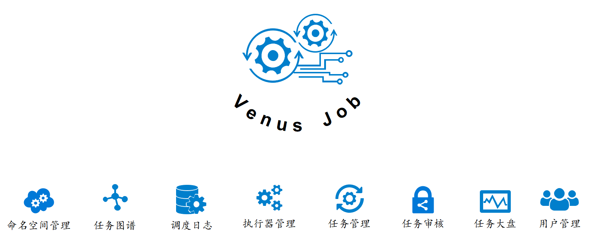
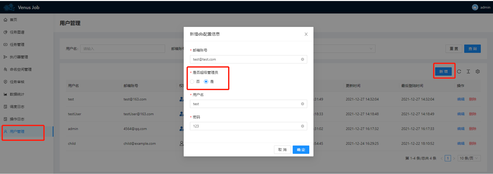
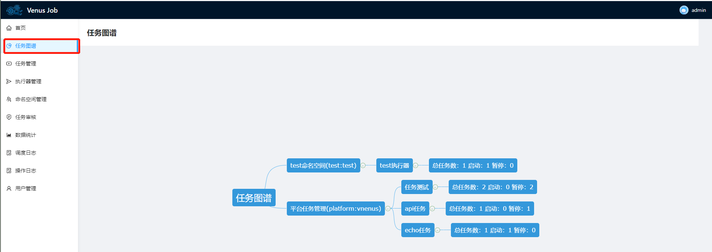

# venus-job

#轻量级分布式任务调度系统


## 目录

* [1.简介](#1)

* [2.基于源码部署](#2)

* [3.使用手册](#3)

    * [3.1 用户管理](#4)
    
    * [3.2 命名空间管理](#5)
    
    * [3.3 编写任务客户端代码](#6)
    
    * [3.4 执行器管理](#7)
    
    * [3.5 任务管理](#8)
    
    * [3.6 任务图谱](#9)
    
    * [3.7 数据统计](#10)
    
    * [3.8 操作日志](#11)

<h3 id="1">1. 简介</h3>

Venus Job是一个分布式的任务调度平台，主要有以下功能：

* 命名空间管理：对调度任务做命名空间划分，便于管理

* 任务图谱：对所有任务的关系做实时可视化展示

* 调度日志： 提供所有任务调度的执行日志

* 执行器管理: 对任务执行的物理机或者虚拟机做管理，展示执行器的资源占用情况

* 任务管理：对要调度的任务做管理

* 任务审核： 对任务的增删改做审批流，减少任务误操作造成的生产故障。

* 任务大盘：提供任务的整体大盘展示功能

* 用户管理：对系统的用户做管理，同时提供审计日志功能。

Venus Job基于xxl-job 2.0.2，相比xxl-job，主要的增强功能点有：
* 客户端资源监控：提供宿主机的CPU，内存等资源监控信息
* 任务变更审核机制：对任务的增删改做审批流控制
* 操作审计日志: 所有操作皆有记录，便于后续做安全审计

<h3 id="2">2. 基于源码部署</h3>

1. 部署前提条件

* 

* 

* 

* 

Step 1： 下载源码
```
git clone https://github.com/venus-suite/venus-job.git
```
Step 2：编译打包前端代码
```
cd  venus-job-web
npm run build:staging
```

Step 3(可选)：本地调试前端代码
```
npm run dev
```

Step 4：编译打包后端代码

先编辑venus-job-admin\src\main\resources\application.yml 修改mysql连接字符串
接着开始打包：

```
cd venus-job-admin
mvn package 
```

Step 5：运行程序

```
java  -jar venus-job-admin-0.0.1.jar
```

Step 6：浏览器输入 http://localhost:8901 访问，默认管理员账号密码admin/admin

```
java  -jar venus-job-admin-0.0.1.jar
```

<h3 id="3">3. 使用手册</h3>



<h5 id="4">3.1 用户管理</h3>
仅具有超级管理员角色的用户才能使用用户管理模块。Venus-Job里有两类用户角色，超级管理员和普通用户。
* 超级管理员：有整个系统所有的权限，用户管理模块和命名空间管理模块只有具有超级管理员角色的人才能操作
* 普通用户： 只有业务系统的权限，

超级管理员具有的权限：
* 添加新用户，并设置用户的密码，
* 修改其他用户的密码
* 添加新的命名空间
* 修改已有命名空间的配置
* 管理命名空间可见的用户
* 查看操作日志
* 普通用户具有的所有权限 

普通用户具有的权限：
* 有权限的命名空间内的执行器管理
* 有权限的命名空间内的任务管理
* 有权限的命名空间内的任务审核
* 任务图谱
* 数据统计
* 有权限的命名空间内的调度日志

有管理员权限的账号，在“用户管理”菜单，点击“新建”按钮，在弹出的菜单里可以为新用户选择是否作为超级管理员。


<h5 id="5">3.2 命名空间管理</h3>
仅具有超级管理员角色的用户才能使用命名空间管理模块。

命名空间可以用于隔离不同的服务，让不同的用户只能看到自己有权限的命名空间，可以起到权限隔离的作用。

有管理员权限的账号，在“命名空间管理”菜单，点击“新建”按钮，在弹出的菜单里可以输入业务名和服务名。


如上图所示，可以创建唯一的命名空间test1:test2。

日志通知推荐填写，方便告警通知。可以是企业微信，钉钉，飞书等提供的WebHook机器人的HTTP地址。

审核通知也推荐填写，方便团队leader在企业微信，钉钉，飞书等提供的WebHook机器人的HTTP地址对应的群收到审核通知后，审核并提供验证码给对应开发，加强对任务操作的流程权限控制，防止生产故障。

命名空间创建完毕后，超级管理员可以为对应的命名空间记录点“新增授权”按钮来添加对应的普通用户。

<h5 id="6">3.3 编写任务客户端代码</h3>

任务客户端JAVA代码可以在单独的工程里完成，在接入前先和管理员确认好要接入的命名空间名字，比如test1:test2。

3.3.1 添加MAVEN依赖：
```
<dependency>
<groupId>com.chuxingyouhui</groupId>
<artifactId>xxl-job-core</artifactId>
<version>0.0.5</version>
</dependency>
```

3.3.2 修改配置文件，这里以application.yml 配置为例：

```
#这里是XXL JOB管理后台的域名或者IP:Port
xxl.job.admin.addresses: http://localhost:8901
 
### xxl-job executor address（执行器名称）
xxl.job.executor.appname: job-api
xxl.job.executor.ip:127.0.0.1
##端口号，不占用就可以
xxl.job.executor.port: 9901
#申请的命名空间（业务名:服务名）
xxl.job.executor.namespace: test1:test2
xxl.job.accessToken: abcdef
### xxl-job log path
xxl.job.executor.logpath: /data/logs/java/anti-code-api/
### xxl-job log retention days, -1表示不作retention
xxl.job.executor.logretentiondays: -1
```

3.3.3 任务配置Bean文件的编写

```
import com.xxl.job.core.executor.impl.XxlJobSpringExecutor;
import org.slf4j.Logger;
import org.slf4j.LoggerFactory;
import org.springframework.beans.factory.annotation.Value;
import org.springframework.context.annotation.Bean;
import org.springframework.context.annotation.Configuration;
 
/**
* xxl-job config
*
*
*/
@Configuration
public class XxlJobConfig {
private Logger logger = LoggerFactory.getLogger(XxlJobConfig.class);
 
@Value("${xxl.job.admin.addresses}")
private String adminAddresses;
 
@Value("${xxl.job.executor.appname}")
private String appName;
 
@Value("${xxl.job.executor.ip}")
private String ip;
 
@Value("${xxl.job.executor.port}")
private int port;
 
@Value("${xxl.job.accessToken}")
private String accessToken;
 
@Value("${xxl.job.executor.logpath}")
private String logPath;
 
@Value("${xxl.job.executor.logretentiondays}")
private int logRetentionDays;
 
@Value("${xxl.job.executor.namespace}")
private String namespace;
 
 
 
 
@Bean(initMethod = "start", destroyMethod = "destroy")
public XxlJobSpringExecutor xxlJobExecutor() {
logger.info(">>>>>>>>>>> xxl-job config init.");
XxlJobSpringExecutor xxlJobSpringExecutor = new XxlJobSpringExecutor();
xxlJobSpringExecutor.setAdminAddresses(adminAddresses);
xxlJobSpringExecutor.setAppName(appName);
xxlJobSpringExecutor.setIp(ip);
xxlJobSpringExecutor.setPort(port);
xxlJobSpringExecutor.setAccessToken(accessToken);
xxlJobSpringExecutor.setLogPath(logPath);
xxlJobSpringExecutor.setLogRetentionDays(logRetentionDays);
xxlJobSpringExecutor.setNamespace(namespace);
return xxlJobSpringExecutor;
}
```

3.3.4 编写job 函数

```
@JobHandler(value="demoJobHandler")
@Component
public class DemoJobHandler extends IJobHandler {
 
@Override
    public ReturnT<String> execute(String param) throws Exception {
        XxlJobLogger.log("JOB2, Hello World.");
        return SUCCESS;
    }
}
```

<h5 id="7">3.4 执行器管理</h3>

当编写完任务代码并部署后，需要在管理后台的“执行器管理”模块增加对应的任务信息

在“执行器管理”菜单，点击“新建”按钮，在弹出的菜单里可以输入服务名并选择命名空间。

注意：
* 服务名要和3.3.2中客户端配置中的xxl.job.executor.appname一致
* 命名空间要和3.3.2中客户端配置中的xxl.job.executor.namespace一致

如果该命名空间开启了任务审核通知，需要对应的管理员在webhook对应群里获取验证码，在“任务审核”菜单审核通过后，才能生效。
如果该命名空间开启了任务审核通知，则新建完毕后立即生效。

如果有执行器注册上来，则可以查看执行器对应的宿主机的关键KPI指标。如下图所示：


<h5 id="8">3.5 任务管理</h3>

当添加完执行器之后，可以在“任务管理”菜单，点击“新建”按钮，添加任务， 菜单和XXLJOB的一样。参考XXLJOB的配置方式即可。

如果该命名空间开启了任务审核通知，需要对应的管理员在webhook对应群里获取验证码，在“任务审核”菜单审核通过后，才能生效。
如果该命名空间开启了任务审核通知，则新建完毕后立即生效。

任务建立完毕后，可以点击“编辑”按钮重新编辑任务详情。同时可以使用“启动”按钮对任务进行正式启动，启动后，可以在“调度日志：菜单查看任务调度日志。

<h5 id="9">3.6 任务图谱</h3>

可以查看所有命名空间，执行器和任务的拓补结构图，如下图所示：



<h5 id="10">3.7 数据统计</h3>

可以查看整个系统的运行大盘情况


<h5 id="11">3.8 操作日志</h3>

仅具有超级管理员角色的用户才能使用操作日志模块。

可以对所有用户对Venus-Job的关键操作进行审计，减少安全风险。


